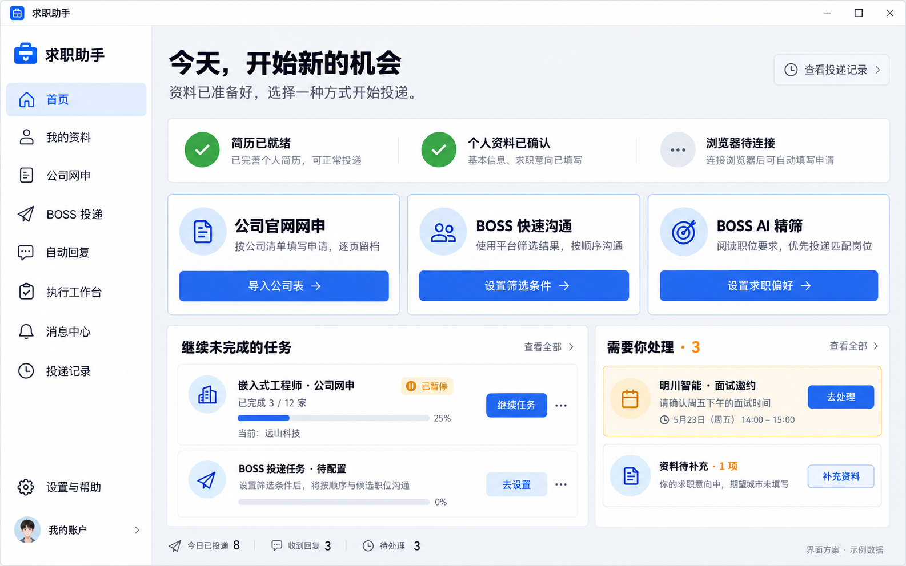

# 桌面应用第一版界面

八张界面稿已获确认，作为第一版视觉基准；图片由 GPT Image 生成，全部为虚构示例数据。**这些图片是设计稿，桌面应用尚未实现。**

在 GitHub 点击下表查看原图；克隆仓库后，用浏览器打开同目录 [index.html](index.html) 可连续浏览八页。GitHub 文件页仅展示 HTML 源码，不代表图册已部署为网站。

| 页面 | 主要功能 |
|---|---|
| [01 首页](01-home.png) | 三类投递入口、继续任务、待办 |
| [02 我的资料](02-profile.png) | 导入、字段核对、来源查看 |
| [03 公司网申](03-companies.png) | 公司表格、范围选择、任务配置 |
| [04 BOSS 投递](04-boss.png) | 推荐沟通、AI 精筛、筛选条件 |
| [05 自动回复](05-replies.png) | 条件与原话编辑、匹配测试 |
| [06 执行工作台](06-running.png) | 队列、截图、步骤、暂停接管 |
| [07 消息中心](07-inbox.png) | 面试处理、编辑、确认发送、独立恢复 |
| [08 投递记录](08-history.png) | 检索、结果、填写内容与截图证据 |

## 实施依据

- [桌面应用设计](desktop-spec.md)：已确认功能、数据与行为约束。
- [Codex 接入验证](codex-probe.md)：真实验证结果、失败发现及未验证范围。
- [实施计划](../../superpowers/plans/2026-10-06-desktop-app-v1.md)：开发顺序与验收条件。
- [原始提示词](prompts.json)、[定向修正提示词](edits.json)：生成过程记录。

图中个别格式提示、日期和微型文字仅作视觉占位。个人资料导入按设计说明支持文字型 PDF、Word `.docx` 和现有 JSON；公司清单独立支持 Excel/CSV。图稿早期出现的其他资料格式文字不代表承诺。实施时统一侧栏、按钮、字体及示例身份，并补齐加载、空态、连接失败和确认对话框。
